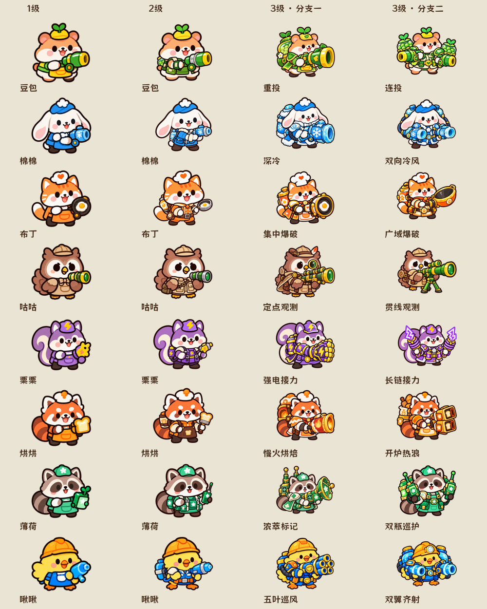

# 1.7.3 圆体、补给排版与店员等级形象

本轮实现并完成自动检查，真实运行截图和目视验收仍待完成。修改游戏本地显示，保留战斗数值、关卡、三选一发卡/广告次数和点击空白关闭菜单规则。

## 店员等级

- 8名店员保留1级造型，新增8张独立2级PNG。绿色/蓝色/橙色工作背心、护腕、背包和加强工具作为识别点。
- 重做16张3级进化PNG，分支用大型单发、双持、宽口、长管、电爪、烤炉、天线与多管装备区分；保留原动物、帽子和配色，不用更换动物表示进化。
- 等级小圆点替换成独立金色星星PNG，尺寸7.5、间距8.8，由Global原始表管理。所有等级与分支透明画布统一256×256，四周8像素留白。
- 新增StaffVisual.xlsx，32条记录覆盖8×基础1/2级与16个分支。战斗、图鉴共用图片键；原始表管理显示比例。更新后图鉴基础2级按钮会真实换图。
- 原始生成PNG和提示词存入source_assets/art/production/staff_progression_20261008。16个旧进化PNG保留UUID，不新增图集。

下图是资源对照，**不是游戏运行截图**：

## 字体和界面

- 33套预制体的238个Label使用同一圆体字体资源。新增UiLayout.fontPath，编译为原生TTFFont引用，不依赖用户系统字体。
- 采用[官方猫啃珠圆体](https://www.maoken.com/freefonts/17948.html)，源字体、OFL1.1许可及中文许可说明入库。运行子集302628字节；export-font.py从原始I18.xlsx取字，check-font门禁检查签名和缺字。新增文本须先重新导出字体子集。
- 彩色操作按钮白字描边，金色按钮棕色描边、绿色按钮深绿描边。取消会覆盖该样式的GM关卡字体变色逻辑；选中和不可用状态仍由PNG显示。
- 胜利页增加月亮/兔店员标题横幅，标题、统计、解锁和操作分开排版。夜班补给保持三张竖卡，重新布置浅绿标题、大图标、完整棕色效果说明、角色增强行和绿色选择按钮，刷新计数/黄色广告按钮在下方。
- 图标与说明、角色行与按钮留出间隔；不添加分类标签或联动提示，不删改卡牌效果描述。

## 配置与技术边界

运行28张原始表和CSV，33套Prefab、1761个配置节点、ArtFrame91项、VisualSkin135项、ArtCut142项。Global.version与package.json为1.7.3。角色图片键、缩放、星星、字体、字号、字色、描边、排版来自原始表。

算法例外：基础1/2级和三级分支为当前玩法的等级协议；历史GM最高等级没有分支时用2级基础形象兼容显示。形象scale>0且≤1.5是防止异常资源无限放大的校验上界，不是玩法数值。缓存按配置重装清空，进化归属与等级不匹配时拒绝显示。

## 验证

- 28张原始XLSX与CSV/manifest一致，33套Prefab/1761节点及字体门禁通过。
- 配置回归30项、资源回归12项、挑战规则回归27项（含70种四人阵容×32种随机种子），合计69项通过；TypeScript noEmit通过。
- 32张强化卡离线字体测量可用13号字放入说明框；图标与说明、角色行与按钮几何不重叠。该测量不是Cocos实际字号证明。
- 32个店员形象的256画布与8像素透明边界检查通过，16个旧进化UUID保持。接触表已人工检查动物身份与装备完整性。
- 最终Web调试、正式包日志出现Finished，并产出字体、28张表和独立PNG。Creator两次退出码均36，存在OTA_VERSION_CONFLICT/构建子进程SIGTERM历史诊断，未确认唯一原因，**不称为退出码0**。日志在G:/gptwork/ui-rounded-supply。
- 本轮浏览器自动化读取127.0.0.1:4344被浏览器工具策略阻止，未绕过限制，**没有完成新版真实四视口截图、全20关或正式包GM运行检查**。上一版的截图/跑测不能替代本轮验收。
- 试玩服务保持独立后台进程，URL仍为http://127.0.0.1:4344/；HTTP资源检查结果另存证据。实体手机、平台字体表现与真实广告未代验。

待用户试玩重点：1/2级实际棋盘大小是否够明显、两进化分支的遮挡、图鉴切图、补给全部说明和胜利标题；待浏览器能力恢复后补真实截图及运行检查。未平台发布。
包体预检：调试/正式各包含28表、25张本轮PNG和302628字节字体；调试debug=true、正式debug=false。试玩入口及29个静态资源请求返回200，见evidence/ui-rounded-supply-1.7.3/build-http.json；HTTP检查不证明游戏已运行通关。

主干同步追加：实现提交e1c83d2已快进合入main。同步后发现Git统一LF导致源码校验签名不一致，导表和校验器生成改为先规范LF再签名，补充隔离CRLF回归；这是导表工具修复，不改变运行算法。后续补丁提交一并同步主干。
