# 内容优化原文归档

来源：用户提供的原始 XLS；按原表顺序保留，未修正文案。18 条有效需求、18 张附图；19～22 为空白，Sheet2、Sheet3 为空。

原始文件 SHA-256：`99257f490864412fd20892a8a7f7ac819c127a3a37a5c400128a408323b85de5`。

本文件仅记录需求来源；实施时序以用户聊天指令和确认后的实施清单为准。

## 01（Sheet1!B2）

避免关卡出现第一关下面红框这里这种无意义的空白区域，建造炮台只能打一条路，位置很尴尬，可以参考中间部分放2排，或者缩小间隙

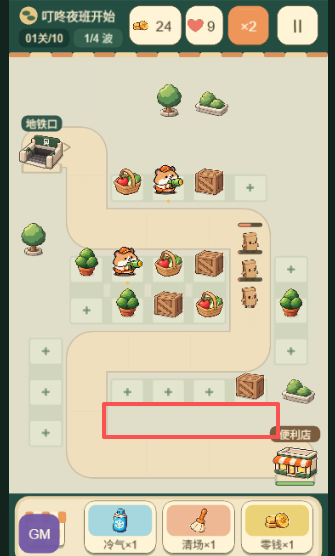

## 02（Sheet1!B3）

避免第一关上面这种，大段的无意义空白区域，如果需要，可以多加一些装饰

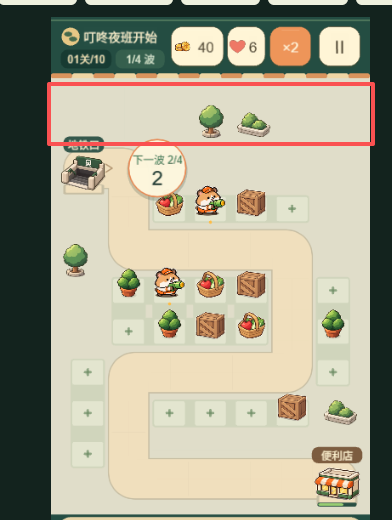

## 03（Sheet1!B4）

初始血量改为10颗心，上面的区域和倍速区域重新排版下，现在几个按钮大小都不一样，看起来有点别扭

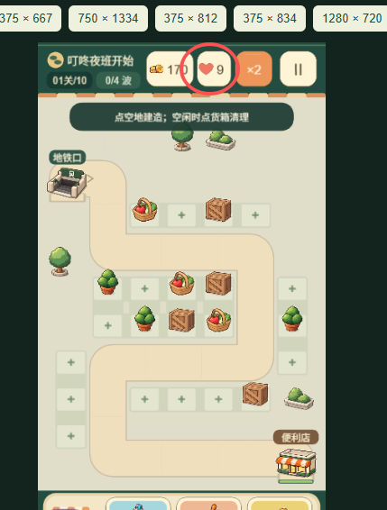

## 04（Sheet1!B5）

关卡左上角的01关/10，改成第x关，要不看不懂

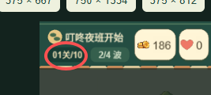

## 05（Sheet1!B6）

暂停界面看起来很不正式，按钮尺寸都不一样，感觉你需要确定按钮规范，处理游戏内所有按钮

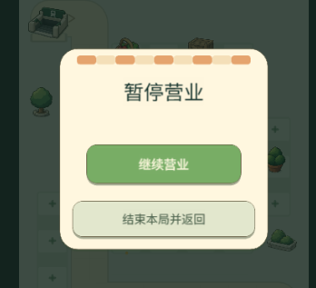

## 06（Sheet1!B7）

结束本局并返回，要返回关卡选择界面

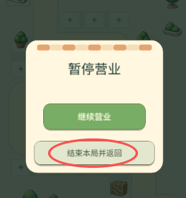

## 07（Sheet1!B8）

冷气，清场，零钱，不能初始就给免费1次，要不关卡有点简单，只能看广告使用

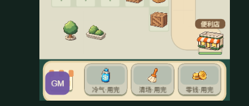

## 08（Sheet1!B9）

收入这里，游戏内的货币包装确认为“金币”XXX金币，这里就写金币

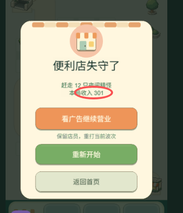

## 09（Sheet1!B10）

图鉴的名字排版，都没有居中，顺便检查下其他文字排版问题

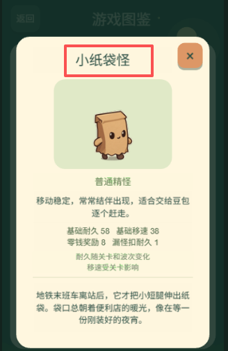

## 10（Sheet1!B11）

未解锁的首领不应该是写后续开放，应该写未遭遇

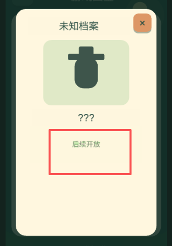

## 11（Sheet1!B12）

耐久可以随着关卡波次变化，但是移速应该是第一个确定的值，不应该受到关卡影响，描述和逻辑都要改

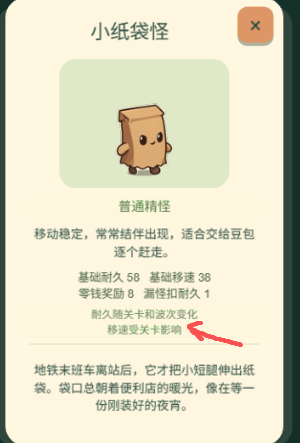

## 12（Sheet1!B13）

属性文字修改

基础耐久改为“血量”
基础移速改为“移速”
零钱奖励改为“金币奖励”
漏怪扣耐久改为“伤害值”

同时，修改怪物和boss属性界面的这部分排版，不要所有文字都居中，可以考虑分块，然后左对齐，并且属性这边可以再前面加小icon

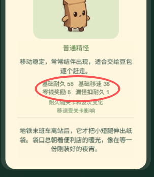

## 13（Sheet1!B14）

店员界面名字也没居中，检查排版

属性文字修改

上岗费用改为“费用”
一级伤害改为“伤害”
攻击间隔改为“攻速”
基础射程改为“射程"

同时，角色具体信息这里也要参考怪物那边，优化排版，不要所有文字都居中，可以考虑分块，然后左对齐，并且属性这边可以再前面加小icon，和怪物那边排版保持一致，看起来舒服

在这个前提下，你要在角色这边新增3个切换按钮，点击可以切换查看1级，2级，3级的属性

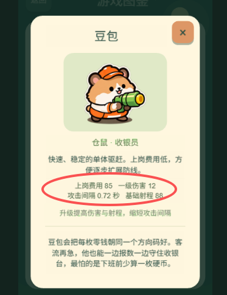

## 14（Sheet1!B15）

还有一个不知道是不是本地存储还是bug，我的号一开始进来就是解锁第5关了，不是从第一关开始的

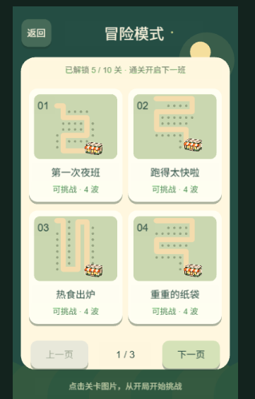

## 15（Sheet1!B16）

主界面图片，出现了层级错误，你检查下，偶现的，可能是加载问题

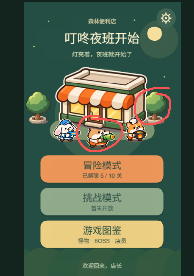

## 16（Sheet1!B17）

挑战模式需求：

挑战模式每天固定1关，波次很多（20波以上），难度很大，只能使用限定的店员，期望玩家很难在一次广告都不看的情况下通关，最终的通关状态，大概是玩家80%的格子上都布满店员，并且有升级，并且店员需要比较合理的搭配，才能通关挑战模式

你先根据我的需求，仔细分析一下，给出分析的结论，然后只做1个挑战模式关卡，点击直接进入这一关，我进行体验

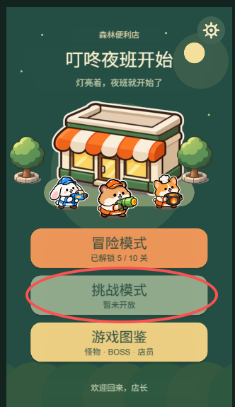

## 17（Sheet1!B18）

前面3关的难度要单独调低一点，尽量保证玩家在不清理障碍的情况下，也能比较轻松的通关，如果有少量清理，即可满血通关，我现在第一关第一波必然漏怪，太难了

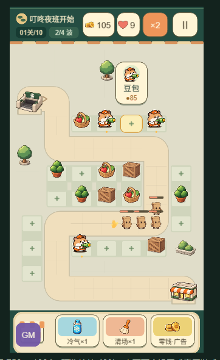

## 18（Sheet1!B19）

1. 参考王国保卫战，每一波的波次倒计时，提高到10秒，玩家可以在倒计时期间，点击气泡，提前开启下一波，气泡配字“开始下一波”

2. 下一波不用写“1/4”，直接写下一波和倒计时即可

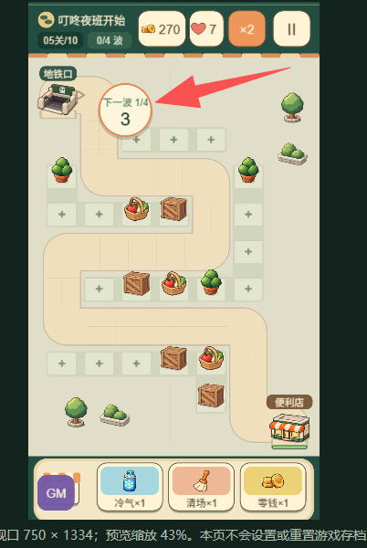
